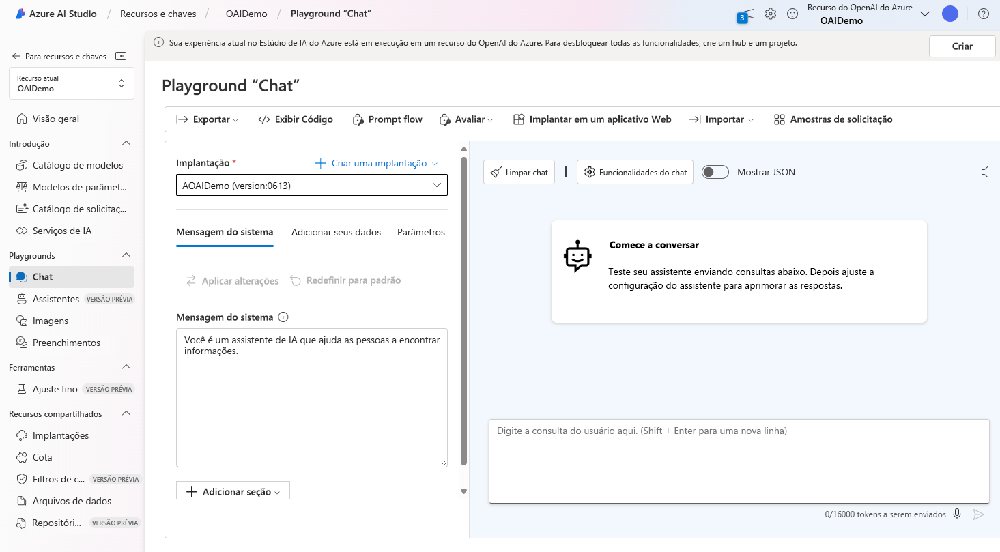

# Explorando a Inteligência Artificial Generativa no Azure AI Foundry Portal

Este guia prático detalha os passos para começar a usar as capacidades de IA generativa no **Azure AI Foundry Portal**, a plataforma da Microsoft para criação de aplicações inteligentes. Ele aborda desde a configuração inicial de um projeto até a exploração do Chat playground e dicas para otimizar as interações com modelos de linguagem.

## O que é IA Generativa?

A IA generativa é uma categoria da inteligência artificial focada na **criação de conteúdo**. Isso pode incluir texto, imagens, código e muito mais. Uma forma comum de interação com IA generativa é através de **aplicações de chat**, que você pode experimentar e construir no Azure AI Foundry.

## Primeiros Passos no Azure AI Foundry Portal

Para começar, você precisa acessar o portal e criar um projeto.

1.  **Acessar o Portal:** Abra seu navegador e vá para **https://ai.azure.com**. Faça login com suas credenciais do Azure. Se for seu primeiro acesso, feche as dicas iniciais.

2.  **Criar um Projeto:**
    *   Navegue para **https://ai.azure.com/managementCenter/allResources**.
    *   Selecione **Create**.
    *   Escolha a opção para criar um **novo recurso de AI hub**.

3.  **Configurar o Projeto:** No assistente *Create a project*, insira um nome válido para o seu projeto.
    *   Se um hub existente for sugerido, escolha a opção para criar um **novo**.
    *   Expanda **Advanced options** para definir as seguintes configurações:
        *   **Subscription:** Sua assinatura do Azure.
        *   **Resource group:** Crie ou selecione um grupo de recursos.
        *   **Region:** Selecione uma das localizações suportadas:
            *   East US
            *   France Central
            *   Korea Central
            *   West Europe
            *   West US

4.  **Aguarde a Criação:** Espere até que seu projeto e hub sejam criados. Ao final, você será direcionado para a página de *Overview* com os detalhes do projeto.

## Explorando o Chat Playground

O Chat playground é uma interface dentro do Azure AI Foundry que permite **experimentar a construção de uma aplicação de chat** usando diferentes modelos de IA generativa.

1.  **Acessar o Playground:** No menu esquerdo da página de *Overview* do seu projeto, selecione **Playgrounds**. Em seguida, escolha **Try the Chat playground**.

2.  **Associar um Modelo:** Para usar o Chat playground, você precisa associá-lo a um modelo implantado.
    *   No Chat playground, selecione **Create a deployment**.
    *   Procure e selecione **gpt-4**.
    *   Na janela *Deploy model*, mantenha as opções e nomes padrão e clique em **Deploy**. A implantação pode levar alguns instantes. Você pode verificar o status em *Models and endpoints* no menu esquerdo, sob *My assets*.

3.  **Usar o Modelo Implantado:** Uma vez que o modelo esteja implantado, selecione-o no menu *Deployment* no Chat playground. É **fundamental** selecionar **Apply changes** após fazer qualquer ajuste na seção *Setup*.




## Dicas para Melhorar Respostas da IA Generativa

As fontes fornecem ótimas dicas para obter melhores resultados ao interagir com um assistente de IA generativa:

*   **Comece com um objetivo específico:** Defina claramente o que você quer que o assistente faça.
*   **Itere com base em interações anteriores:** Refine os resultados usando prompts subsequentes que se baseiam nas respostas anteriores.
*   **Forneça uma fonte:** Direcione a IA para usar informações de um escopo específico, como um URL.
*   **Adicione contexto:** Inclua informações relevantes para maximizar a adequação e relevância da resposta.
*   **Defina expectativas claras:** Especifique o formato, extensão ou o tipo de informação esperada na resposta.

## Exemplos Práticos (Iterando e Refinando)

Vamos ver como as dicas acima são aplicadas com exemplos de prompts diretamente das fontes.

1.  **Prompt Inicial (Objetivo Específico):**
    ```
    I'm planning a trip to Paris in September. Can you help me?
    ```
    Este prompt define o objetivo inicial. A resposta pode variar devido à natureza da IA generativa.

2.  **Prompt de Iteração (Baseado na Resposta Anterior):**
    ```
    Where's a good location in Paris to stay?
    ```
    Este prompt refina a conversa, pedindo sugestões de hospedagem. A resposta deve listar alguns lugares.

3.  **Mais Iteração (Continuando a Refinar):**
    ```
    Can you give me more information about dining options near the first location?
    ```
    Aqui, usamos a resposta anterior sobre localizações de estadia para perguntar sobre restaurantes próximos ao primeiro local mencionado. A resposta deve focar em opções de jantar naquela área.

4.  **Prompt com Fonte Específica (Grounding):**
    ```
    Based on the information at https://en.wikipedia.org/wiki/History_of_Paris, what were the key events in the city's history?
    ```
    Este exemplo demonstra como "aterrar" (ground) a resposta da IA em uma fonte de informação específica (um artigo da Wikipedia sobre a história de Paris). A resposta deve se basear no conteúdo do URL fornecido.

5.  **Prompt com Contexto Adicional:**
    ```
    What three places do you recommend I stay in Paris to be within walking distance to historical attractions? Explain your reasoning.
    ```
    Adicionamos contexto (proximidade a atrações históricas) e definimos expectativas (três lugares, com raciocínio) para maximizar a relevância da resposta.

6.  **Prompt com Expectativas Claras (Formato e Quantidade):**
    ```
    What are the top 10 sights to see in Paris? Answer with a numbered list in order of popularity.
    ```
    Este prompt especifica claramente o formato desejado (lista numerada), a quantidade de itens (top 10) e a ordem (por popularidade). A resposta deve seguir estas instruções.


## Links Úteis e Informações Adicionais

*   **Azure AI Foundry Portal:** **https://ai.azure.com**
*   **Gerenciamento de Recursos:** **https://ai.azure.com/managementCenter/allResources**
*   **Laboratórios Substituídos:** As fontes e mencionam que alguns laboratórios práticos foram aposentados. Se você estiver procurando por laboratórios sobre filtros de conteúdo ou uma introdução ao AI Studio, os links de substituição são:
    *   Explore Content Filters (Substituição): **https://microsoftlearning.github.io/mslearn-ai-studio/Instructions/06-Explore-content-filters.html**
    *   Explore AI Studio (Substituição): **https://microsoftlearning.github.io/mslearn-ai-studio/Instructions/01-Explore-ai-studio.html**
    Note que estes links de substituição referem-se a outros laboratórios práticos e não ao guia passo a passo para usar o Chat playground no Azure AI Foundry descrito.

## Conclusão

O Azure AI Foundry Portal oferece um ambiente poderoso e acessível para experimentar e construir com IA generativa. Seguindo os passos de criação de projeto e utilizando o Chat playground com modelos como o GPT-4, você pode explorar o potencial dessa tecnologia. Lembre-se das dicas para elaborar prompts eficazes – definir objetivos claros, iterar, fornecer contexto e fontes, e definir expectativas – para obter as melhores respostas do assistente de IA. Dominar estas interações é uma habilidade valiosa no cenário atual da inteligência artificial.

